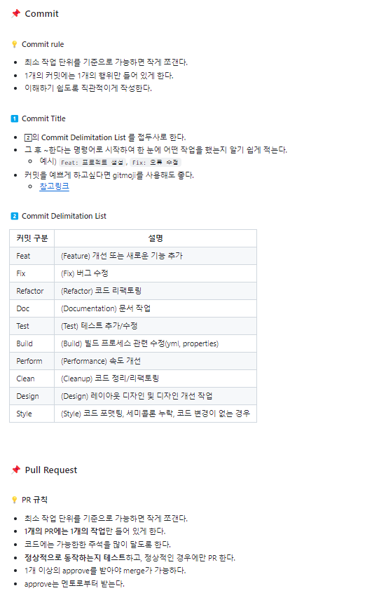

# GitHub 사용법 안내서

## 1. GitHub이란 무엇인가?
GitHub은 Git 저장소를 호스팅하는 웹 기반 서비스로, 소프트웨어 개발 프로젝트를 관리하고 협업을 지원합니다. GitHub을 사용하면 원격 저장소를 통해 코드를 공유하고 협업할 수 있습니다.

## 2. GitHub 계정 만들기
1. [GitHub 공식 사이트](https://github.com/)에 접속합니다.
2. 우측 상단의 `Sign up` 버튼을 클릭합니다.
3. 이메일, 비밀번호, 사용자 이름을 입력하고 계정을 만듭니다.
4. 이메일 인증을 완료하고 프로필을 설정합니다.

## 3. GitHub 저장소 생성
1. GitHub에 로그인한 후, 우측 상단의 `+` 버튼을 클릭하고 `New repository`를 선택합니다.
2. 저장소 이름을 입력하고, 설명을 추가한 후 `Public` 또는 `Private`을 선택합니다.
3. `Initialize this repository with a README` 옵션을 선택할 수 있습니다.
4. `Create repository` 버튼을 클릭하여 저장소를 생성합니다.

## 4. 로컬 저장소와 GitHub 원격 저장소 연결
1. 로컬 저장소를 초기화합니다.
    ```bash
    git init
    ```
2. GitHub에서 생성한 원격 저장소 URL을 복사합니다.
3. 로컬 저장소에 원격 저장소를 추가합니다.
    ```bash
    git remote add origin <repository_url>
    ```

## 5. 변경 사항 푸시 및 풀

### 변경 사항 푸시
1. 변경 사항을 커밋합니다.
    ```bash
    git add .
    git commit -m "커밋 메시지"
    ```
2. 변경 사항을 원격 저장소로 푸시합니다.
    ```bash
    git push origin <branch_name>
    ```

### 원격 저장소에서 변경 사항 풀
1. 원격 저장소의 변경 사항을 로컬로 가져옵니다.
    ```bash
    git pull origin <branch_name>
    ```

## 6. 브랜치 및 Pull Request(PR)

### 브랜치 생성 및 전환
1. 새로운 브랜치를 생성하고 전환합니다.
    ```bash
    git checkout -b <branch_name>
    ```

### Pull Request 생성
1. 변경 사항을 원격 저장소의 새로운 브랜치로 푸시합니다.
    ```bash
    git push origin <branch_name>
    ```
2. GitHub 웹사이트에서 해당 저장소로 이동합니다.
3. `Pull requests` 탭을 클릭하고 `New pull request` 버튼을 클릭합니다.
4. 비교할 브랜치들을 선택하고, 변경 사항을 확인한 후 `Create pull request` 버튼을 클릭합니다.
5. PR 제목과 설명을 작성하고 리뷰어를 지정합니다.

## 7. 코드 리뷰 및 병합

### 코드 리뷰
1. PR 페이지에서 코드 변경 사항을 확인합니다.
2. 필요시 `Review changes` 버튼을 클릭하여 피드백을 남기고 `Approve` 또는 `Request changes`를 선택합니다.

### PR 병합
1. 모든 리뷰어가 PR을 승인하면 `Merge pull request` 버튼을 클릭하여 PR을 병합합니다.
2. 병합 후, 로컬 저장소를 최신 상태로 유지하기 위해 변경 사항을 가져옵니다.
    ```bash
    git pull origin main
    ```

## 8. GitHub 협업 시 주의사항

### 협업 규칙
1. **작은 단위로 커밋**: 작은 단위로 자주 커밋하여 변경 사항을 관리하기 쉽게 합니다.
2. **명확한 커밋 메시지**: 커밋 메시지는 변경 사항의 목적과 내용을 명확하게 설명합니다.
3. **기능 브랜치 사용**: 새로운 기능이나 버그 수정은 항상 별도의 브랜치에서 작업합니다.
4. **PR 템플릿 사용**: 팀에서 정의한 PR 템플릿을 사용하여 PR 작성 시 중요한 정보를 포함하도록 합니다.
5. **자동화된 테스트**: PR 생성 시 자동화된 테스트를 실행하여 코드의 안정성을 확인합니다.
6. **정기적인 동기화**: 로컬 브랜치와 원격 브랜치를 정기적으로 동기화하여 최신 상태를 유지합니다.


## 커밋 및 PR 규칙 예시
##### HSU-Likelion-Backend 과제제출 커밋 룰

